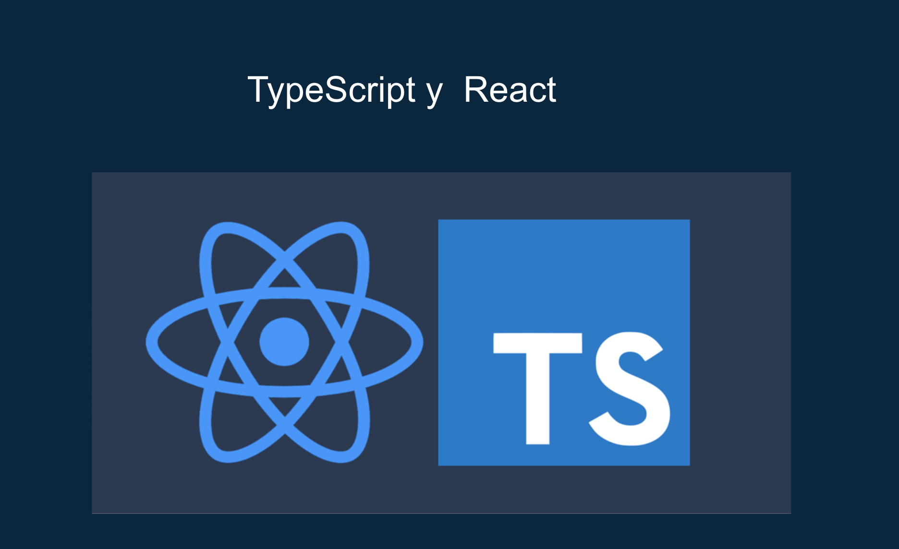
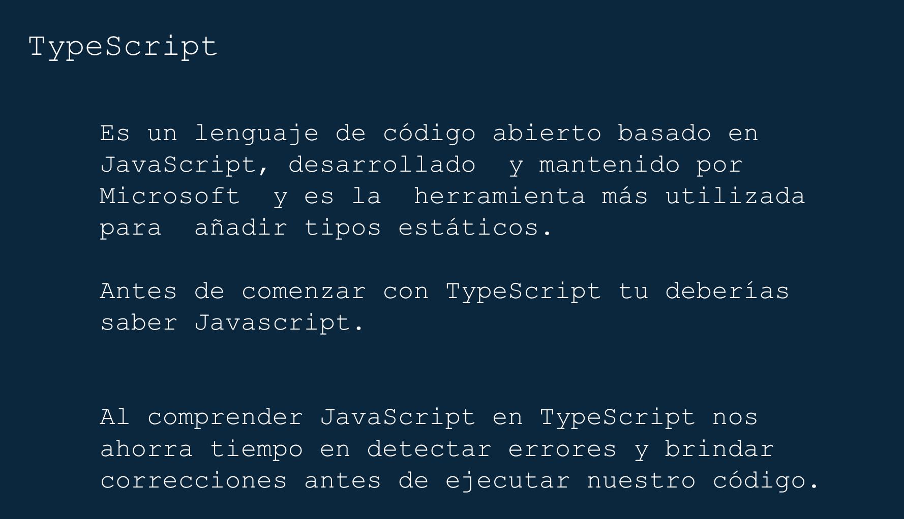
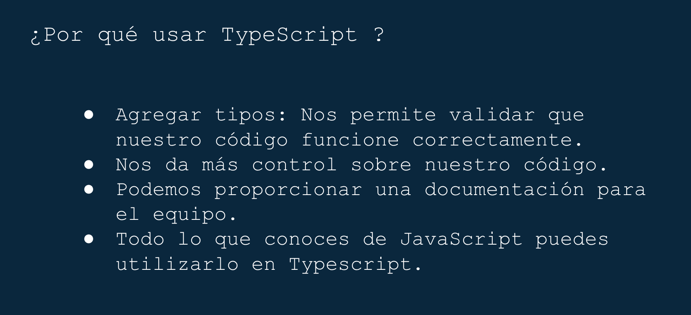

### Previniendo errores con TypeScript en React.

## Descripción

Este proyecto es el demo del workshop en _Noches GDG UNAM_, puedes ver el live [aquí](https://www.facebook.com/GDGUNAM/videos/2670004176584311).

## Slides

  
 

 

  
 

 

  
 

## Recursos

- [Create react app](https://create-react-app.dev/docs/adding-typescript/)
- [TypeScript](https://www.typescriptlang.org/)
- [SpaceX-API](https://github.com/r-spacex/SpaceX-API/blob/master/docs/v4/rockets/all.md)

with :heart: Nancy Zitle.
